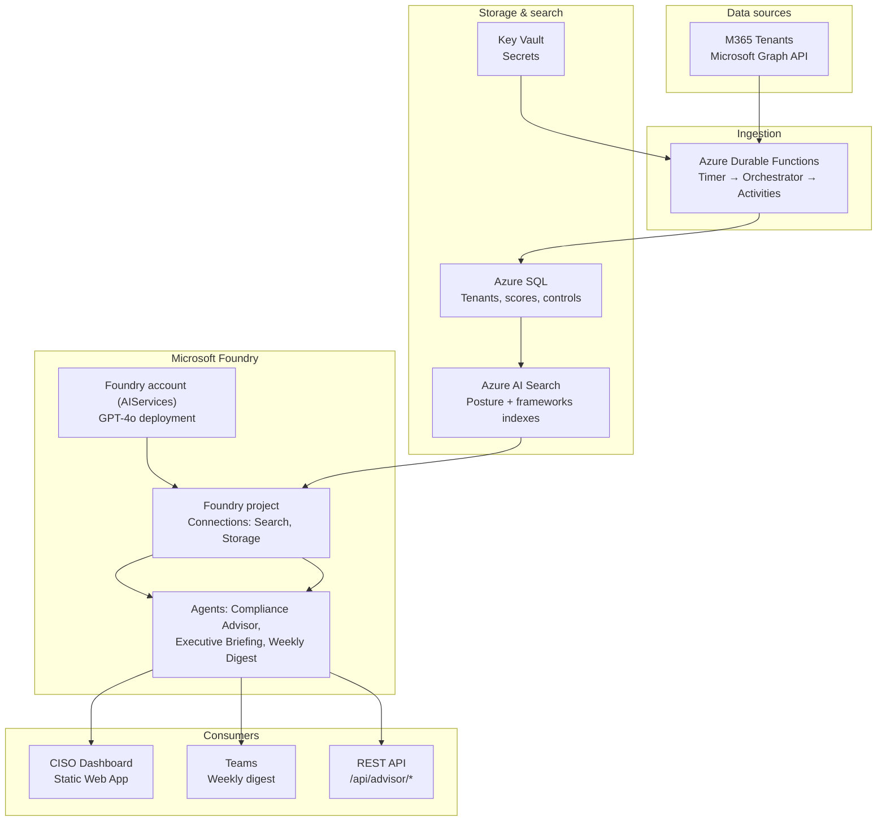

# Compliance Advisor — Multi-Tenant Microsoft Purview Dashboard on Microsoft Foundry

An AI-powered compliance advisor that aggregates Microsoft Secure Score data
across multiple M365 tenants and delivers natural-language insights via
Microsoft Foundry (Prompt Flows / Agents).

## Deploy to Azure

Click the button below to provision all infrastructure in your Azure subscription
(Key Vault · SQL · AI Search · Microsoft Foundry · Azure Functions):

[](https://portal.azure.com/#create/Microsoft.Template/uri/https%3A%2F%2Fraw.githubusercontent.com%2Fchashea%2Fcompliance-advisor%2Fmain%2Fazuredeploy.json)

**You will be prompted for:**
| Parameter | Description |
|-----------|-------------|
| `environmentName` | Short label used in resource names (`dev`, `staging`, `prod`) |
| `location` | Azure region — must support GPT-4o ([check availability](https://aka.ms/oai/models)) |
| `sqlAdminUsername` | SQL Server admin login |
| `sqlAdminPassword` | SQL Server admin password (≥ 12 chars, upper + lower + digit + symbol) |
| `securityAlertEmail` | Email for SQL Defender alerts (optional) |
| `deployerObjectId` | Your Azure AD Object ID — run `az ad signed-in-user show --query id -o tsv` in Cloud Shell |
| `graphNationalCloud` | Leave empty for commercial and M365 GCC. Set to `usgovernment` only for GCC High/DoD ([GCC setup](docs/M365-GCC-SETUP.md)) |

After the portal deployment completes, run the [post-deployment steps](#post-deployment-steps) below.

---

## Architecture

```
                    ┌─────────────────────────────────────────────────────────────────┐
                    │                    M365 Tenants (Microsoft Graph)                 │
                    │         Secure Score · Control Scores · Compliance Manager         │
                    └────────────────────────────────┬────────────────────────────────┘
                                                      │
                                                      ▼
                    ┌─────────────────────────────────────────────────────────────────┐
                    │              Azure Durable Functions (daily fan-out)              │
                    │   Timer → Orchestrator → Activities (per-tenant collect + sync)   │
                    └────────────────────────────────┬────────────────────────────────┘
                                                      │
                    ┌─────────────────────────────────┼─────────────────────────────────┐
                    ▼                                 ▼                                 ▼
           ┌────────────────┐              ┌────────────────────┐              ┌─────────────────┐
           │   Azure SQL    │              │  Azure AI Search    │              │  Key Vault       │
           │  (posture +    │──────────────│  (compliance-       │──────────────│  (secrets)       │
           │   tenants)     │   index      │   posture,          │   RAG        │                  │
           └────────────────┘              │   frameworks)       │              └────────┬────────┘
                    │                      └──────────┬───────────┘                       │
                    │                                 │                                  │
                    └─────────────────────────────────┼──────────────────────────────────┘
                                                      ▼
                    ┌─────────────────────────────────────────────────────────────────┐
                    │                  Microsoft Foundry (AIServices)                   │
                    │   Foundry Project · GPT-4o deployment · Connections (Search+KV)  │
                    │   Agents: Compliance Advisor · Executive Briefing · Weekly Digest │
                    └────────────────────────────────┬────────────────────────────────┘
                                                      │
                    ┌─────────────────────────────────┼─────────────────────────────────┐
                    ▼                                 ▼                                 ▼
           ┌────────────────┐              ┌────────────────────┐              ┌─────────────────┐
           │ CISO Dashboard │              │   Teams (webhook)   │              │   REST API      │
           │ (Static Web   │              │   Weekly digest     │              │   /api/advisor/* │
           │  App + Chart.js)│              │   (Monday 08:00 UTC)│              │   (Function App) │
           └────────────────┘              └────────────────────┘              └─────────────────┘
```

**M365 GCC:** The only connection into M365 (including GCC) is **Microsoft Graph** (global endpoints) in the sync activities. The agent (Foundry) does not connect to M365 GCC — it only reads from SQL and AI Search, which are populated by that Graph-based sync.

**Mermaid** (renders in GitHub and many Markdown viewers):



## Quick Start

### 1. Deploy Infrastructure

Use the **[Deploy to Azure](#deploy-to-azure)** button at the top of this README for a one-click portal deployment, or run from the CLI:

```bash
az group create --name rg-compliance-advisor-prod --location eastus

az deployment group create \
  --resource-group rg-compliance-advisor-prod \
  --template-file  azuredeploy.bicep \
  --parameters \
      environmentName=prod \
      sqlAdminUsername=sqladmin \
      sqlAdminPassword=<password> \
      deployerObjectId=$(az ad signed-in-user show --query id -o tsv)
```

Outputs (Function App name, SQL FQDN, Search endpoint, Key Vault URI) are shown in the portal and printed by the CLI.

### 2. Apply SQL Schema
```bash
sqlcmd -S <server>.database.windows.net -d ComplianceAdvisor -i sql/schema.sql
```

### 3. Grant Function App database access (RBAC)
So the Function App can connect with Entra ID (managed identity), add its identity as a database user and grant least-privilege roles. Edit `sql/grant_function_app_rbac.sql` and set `@FunctionAppName` to your Function App name (from deployment output `functionAppName`, e.g. `func-compliance-advisor-prod`), then run:
```bash
sqlcmd -S <server>.database.windows.net -d ComplianceAdvisor -i sql/grant_function_app_rbac.sql
```

### 4. Create AI Search Indexes and Seed Framework Data
```bash
pip install azure-search-documents azure-identity azure-keyvault-secrets

# Create index schemas
python scripts/setup_search_index.py \
  --endpoint https://<search-name>.search.windows.net \
  --key <admin-key>

# Seed the compliance-frameworks index with NIST, ISO 27001, SOC 2, CIS data
export AZURE_SEARCH_ENDPOINT=https://<search-name>.search.windows.net
export AZURE_SEARCH_KEY=<admin-key>
python scripts/seed_frameworks_index.py
```

### 5. Onboard Your First Tenant

In each source M365 tenant, create an App Registration:
- **API permission**: `SecurityEvents.Read.All` (Application)
- Grant admin consent
- Create a client secret

Then run:
```bash
chmod +x scripts/onboard_tenant.sh
./scripts/onboard_tenant.sh \
  --tenant-id      "<entra-tenant-guid>" \
  --display-name   "Contoso Europe" \
  --region         "EU" \
  --department     "Finance" \
  --department-head "Jane Smith" \
  --risk-tier      "High" \
  --app-id         "<app-registration-client-id>" \
  --key-vault      "kv-compliance-advisor-prod" \
  --sql-server     "sql-compliance-advisor-prod.database.windows.net" \
  --sql-db         "ComplianceAdvisor"
```

The client secret is read from **stdin** (not a CLI flag) to avoid appearing in
shell history or process listings.

## Post-Deployment Steps

After the "Deploy to Azure" button deployment (or Terraform apply) completes:

### Apply SQL Schema
```bash
sqlcmd -S <server>.database.windows.net -d ComplianceAdvisor -i sql/schema.sql
```
The server FQDN is shown in the portal deployment outputs as `sqlServerFqdn`.

### Grant Function App database access (RBAC)
Edit `sql/grant_function_app_rbac.sql`: set `@FunctionAppName` to the deployment output `functionAppName` (e.g. `func-compliance-advisor-prod`). Then run:
```bash
sqlcmd -S <server>.database.windows.net -d ComplianceAdvisor -i sql/grant_function_app_rbac.sql
```
This creates a database user for the Function App’s managed identity and grants least-privilege roles so the app can connect with Entra ID.

### Create AI Search Indexes and Seed Framework Data
```bash
pip install azure-search-documents azure-identity

# Create index schemas
python scripts/setup_search_index.py \
  --endpoint <searchEndpoint>   # from deployment outputs
  --key <admin-key>

# Seed compliance-frameworks index (NIST, ISO 27001, SOC 2, CIS)
export AZURE_SEARCH_ENDPOINT=<searchEndpoint>
export AZURE_SEARCH_KEY=<admin-key>
python scripts/seed_frameworks_index.py
```

### Deploy Function App Code
```bash
cd src/functions
pip install -r requirements.txt --target=".python_packages/lib/site-packages"
func azure functionapp publish <functionAppName>   # from deployment outputs
```

### Deploy Prompt Flows
```bash
pip install promptflow promptflow-azure
pfazure flow create --flow ./prompt_flows/compliance_advisor \
  --resource-group <rg> --workspace-name <foundryProjectName>
pfazure flow create --flow ./prompt_flows/executive_briefing \
  --resource-group <rg> --workspace-name <foundryProjectName>
pfazure flow create --flow ./prompt_flows/weekly_digest \
  --resource-group <rg> --workspace-name <foundryProjectName>
```

## RBAC and access control

Access is enforced with **Azure RBAC** and **SQL database roles** (least privilege).

| Principal | Scope | Role | Purpose |
|-----------|--------|------|---------|
| Deployer (you or CI/CD SP) | Key Vault | Key Vault Secrets Officer | Write secrets during deployment only; restrict or remove in production if desired. |
| Function App (managed identity) | Key Vault | Key Vault Secrets User | Read secrets at runtime (tenant client secrets, Search key, etc.). |
| Function App (managed identity) | Foundry Project | Azure AI User | Invoke Foundry agents (Compliance Advisor, Executive Briefing, Weekly Digest). |
| Foundry Project (managed identity) | Foundry account | Cognitive Services OpenAI Contributor | Use GPT-4o deployment for agents. |
| Foundry Project (managed identity) | AI Search | Search Index Data Reader, Search Service Contributor | RAG retrieval and index management. |
| Foundry Project (managed identity) | Storage (agent) | Storage Blob Data Contributor | Agent file storage. |
| Function App (database user) | SQL Database | db_datareader, db_datawriter, db_ddladmin | App data and Durable Task state; granted via `sql/grant_function_app_rbac.sql`. |
| Optional: readers | Resource group | Reader | Grant `readerPrincipalIds` in Bicep for security/ops (read-only). |

- **Key Vault** uses RBAC only (`enableRbacAuthorization: true`); no access policies.
- **SQL** uses Entra ID; the Function App has no Azure-level SQL role—access is granted inside the database by running `sql/grant_function_app_rbac.sql` after deploy.
- To grant read-only access to the resource group (e.g. security team), pass `readerPrincipalIds` to the deployment:
  ```bash
  --parameters readerPrincipalIds='["<object-id-1>","<object-id-2>"]' readerPrincipalType=User
  ```

## Dashboard

A lightweight CISO-facing dashboard that visualises posture, trends, and
department-level breakdowns using Chart.js.

### Run Locally

```bash
# From the repo root – any static file server works
npx serve dashboard/
# or
python -m http.server 8080 --directory dashboard
```

Open `http://localhost:8080` (or whichever port your server reports).

By default the dashboard assumes the API is at the same origin. To point at a
remote Function App for local development, edit `dashboard/env.js`:
```js
window.COMPLIANCE_API_BASE = "https://<your-function-app>.azurewebsites.net/api/advisor";
window.COMPLIANCE_API_KEY  = "<your-function-key>";  // omit when using SWA auth
```

In production, CI/CD generates `env.js` automatically from the Bicep deployment outputs.

### Deploy as Azure Static Web App

The `dashboard/` folder is ready to deploy as an Azure Static Web App:

```bash
az staticwebapp create \
  --name swa-compliance-dashboard \
  --resource-group rg-compliance-advisor \
  --source . \
  --app-location dashboard \
  --output-location dashboard

# Link the Function App as the API backend
az staticwebapp backends link \
  --name swa-compliance-dashboard \
  --resource-group rg-compliance-advisor \
  --backend-resource-id /subscriptions/<sub>/resourceGroups/<rg>/providers/Microsoft.Web/sites/<func-app>
```

The included `staticwebapp.config.json` enforces Entra ID authentication on
API routes and adds security headers (CSP, X-Frame-Options, etc.).

## Prompt Flow: Compliance Advisor

Ask natural-language questions about your compliance posture:

- *"What are our top 5 gaps against NIST 800-53?"*
- *"Which tenant has the lowest score this week?"*
- *"Summarize our Identity controls across all tenants."*
- *"Which improvement actions would gain us the most points?"*

## Prompt Flow: Executive Briefing

Generates a structured CISO briefing for leadership consumption:

- Enterprise posture summary with week-over-week trends
- Department/agency scorecard with risk-tier breakdown
- Top recommended actions prioritized by business impact
- Risk escalations requiring leadership attention

Call via the HTTP API:
```bash
curl -X POST https://<function-app>.azurewebsites.net/api/advisor/briefing \
  -H "x-functions-key: <function-key>" \
  -H "Content-Type: application/json" \
  -d '{"department": "Finance"}'     # optional — omit for enterprise-wide
```

## HTTP API

The compliance advisor exposes a REST API for dashboards, bots, and integrations:

| Endpoint | Description |
|----------|-------------|
| `POST /api/advisor/ask` | Ask the AI advisor a natural-language question |
| `POST /api/advisor/briefing` | Generate an executive briefing (optionally filtered by department) |
| `POST /api/advisor/compliance` | Compliance Manager scores, trends, and week-over-week changes |
| `POST /api/advisor/assessments` | Assessment summary, control pass rates, and top gaps |
| `POST /api/advisor/regulations` | Regulation coverage — pass rates per framework across all tenants |
| `POST /api/advisor/actions` | Improvement actions with implementation steps and test plans |
| `POST /api/advisor/trends` | Secure Score trends, week-over-week changes, and category breakdowns |
| `POST /api/advisor/departments` | Department/agency rollup with risk-tier summary |
| `POST /api/advisor/status` | Health check — tenant count and sync timestamps |

## Prompt Flow: Weekly Digest

Scheduled flow that posts a GPT-4o generated summary to Teams every Monday.

The Teams webhook URL is read at runtime from Key Vault (`teams-webhook-url` secret).
Store it once with:
```bash
az keyvault secret set \
  --vault-name kv-compliance-advisor-prod \
  --name       teams-webhook-url \
  --value      "<your-teams-incoming-webhook-url>"
```

The schedule (every Monday at 08:00 UTC) is configured automatically on each deploy
via `scripts/configure_weekly_schedule.py`. To configure it manually:
```bash
export AZURE_SUBSCRIPTION_ID=<sub-id>
export AZURE_RESOURCE_GROUP=rg-compliance-advisor-prod
export AI_FOUNDRY_WORKSPACE=aip-compliance-advisor-prod   # or FOUNDRY_PROJECT_NAME for Microsoft Foundry project
python scripts/configure_weekly_schedule.py
```

## CI/CD

Push to `main` triggers the GitHub Actions workflow which:
1. Runs unit tests and dependency audit in parallel
2. Deploys Bicep infrastructure via `az deployment group create` (manual approval gate)
3. Creates/updates AI Search indexes and seeds framework data
4. Deploys Azure Functions
5. Deploys Prompt Flows to Microsoft Foundry and configures the weekly digest schedule
6. Deploys the CISO dashboard to Azure Static Web Apps

**Required GitHub Secrets:**

| Secret | Description |
|--------|-------------|
| `SQL_ADMIN_USER` | SQL server admin username |
| `SQL_ADMIN_PASSWORD` | SQL server admin password |
| `AZURE_SEARCH_ADMIN_KEY` | AI Search admin key |
| `AI_FOUNDRY_WORKSPACE` | Microsoft Foundry project name (or use `FOUNDRY_PROJECT_NAME`) |
| `SWA_DEPLOYMENT_TOKEN` | Static Web App deployment token (`az staticwebapp secrets list`) |

**Required GitHub Variables (`vars.`):**

| Variable | Description |
|----------|-------------|
| `AZURE_CLIENT_ID` | Service principal / managed identity client ID (OIDC federation) |
| `AZURE_TENANT_ID` | Entra ID tenant ID |
| `AZURE_SUBSCRIPTION_ID` | Azure subscription ID |
| `SECURITY_ALERT_EMAILS` | Email address for SQL Defender alerts |

The pipeline uses **OIDC federation** — no long-lived credentials are stored as secrets.
The service principal needs **Contributor** on the resource group and **User Access Administrator**
to assign role assignments within the resource group.

## M365 GCC tenants

**M365 GCC uses the same global endpoints as commercial** (`login.microsoftonline.com`, `graph.microsoft.com`). No special configuration is needed — deploy as usual and register your app in the **same** Entra tenant (your GCC directory). See **[docs/M365-GCC-SETUP.md](docs/M365-GCC-SETUP.md)** for details.

## Data source: Microsoft Purview Compliance Manager

Dashboard and API data is aligned with **Microsoft Purview Compliance Manager**: compliance score (from improvement actions), assessments, improvement actions (controls), implementation status, and test status. See **[docs/DATA-SOURCE-PURVIEW.md](docs/DATA-SOURCE-PURVIEW.md)** for the mapping of Purview concepts and allowed values (e.g. implementation_status, test_status) to the schema and UI.

## Project Structure

```
compliance-advisor/
├── azuredeploy.bicep       # Bicep IaC — all Azure resources in one file
├── azuredeploy.json        # Compiled ARM template (generated — powers Deploy to Azure button)
├── docs/
│   ├── DATA-SOURCE-PURVIEW.md   # Purview Compliance Manager data mapping
│   └── M365-GCC-SETUP.md        # M365 GCC tenant connection
├── src/
│   ├── functions/          # Azure Durable Functions (timer, orchestrator, activities, HTTP API)
│   └── shared/             # auth, graph_client, sql_client helpers
├── sql/                    # Schema, views, trend queries, grant_function_app_rbac.sql
├── prompt_flows/
│   ├── compliance_advisor/ # RAG Q&A agent
│   ├── executive_briefing/ # CISO executive briefing generator
│   └── weekly_digest/      # Scheduled Teams report with trends
├── dashboard/              # CISO dashboard (Chart.js static web app)
├── scripts/
│   ├── onboard_tenant.sh            # Tenant onboarding runbook
│   ├── offboard_tenant.sh           # Tenant offboarding / deactivation
│   ├── setup_search_index.py        # Create AI Search index schemas
│   ├── seed_frameworks_index.py     # Seed compliance-frameworks index
│   └── configure_weekly_schedule.py # Configure weekly digest cron schedule
└── .github/workflows/      # CI/CD pipeline
```
